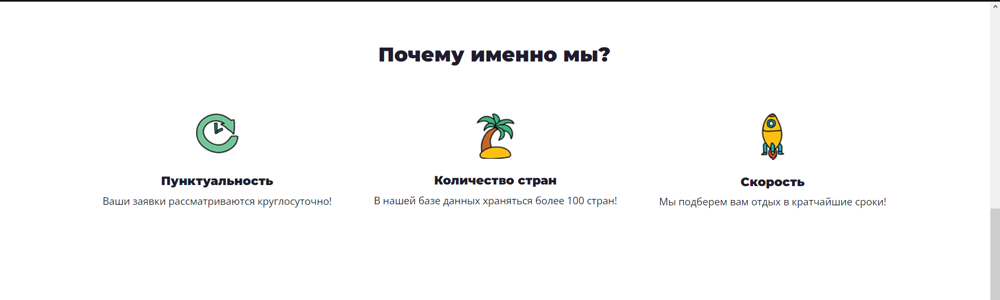
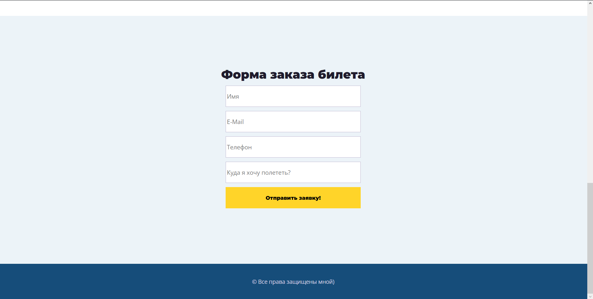
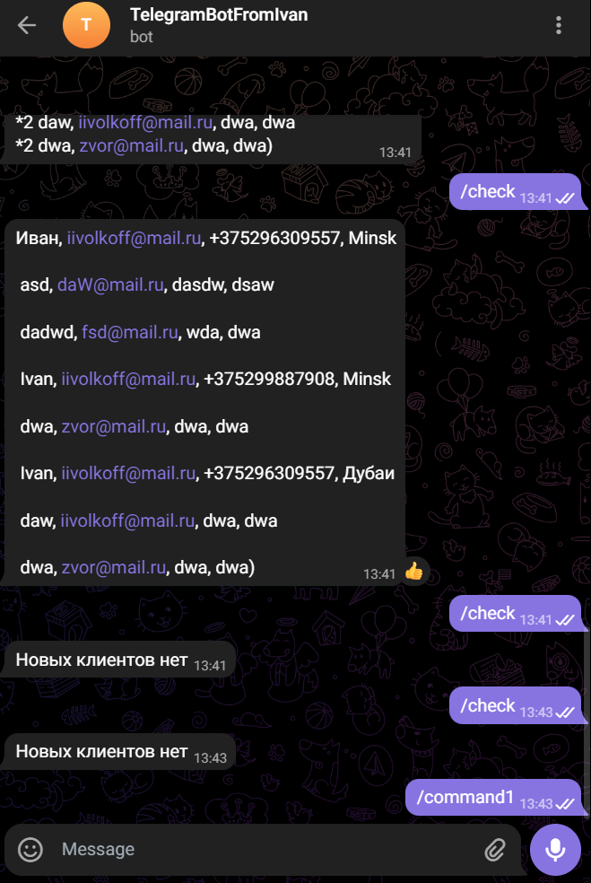

Libraries used: aiogram, psycopg2

Used technologies: Postgresql, Django

To successfully launch the project, you will need to install libraries and enter data about your sql server, Bot-token, and other parameters in the django settings.

The TelegramBot folder contains files for the bot, and the fff-django folder contains files

Telegram bot commands:

/start - main start command

/check - command to view new clients

If you want to run both the telegram bot and the site, then you need to write the command python manage.py runserver in the console, then go to the address localhost:8000 in the browser, and run the project in the IDE
